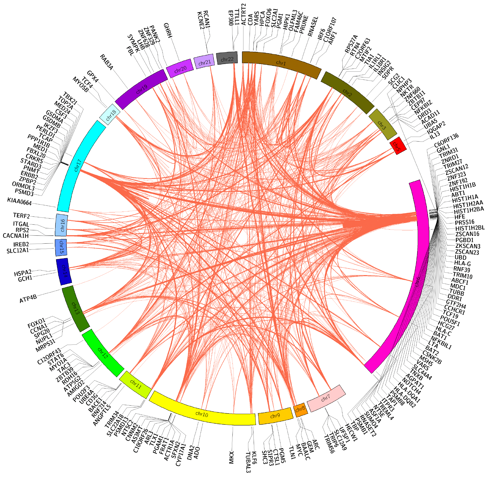

# SigMod user manual

SigMod is an exact and efficient method for identifying strongly interconnected disease-associated modules in gene (protein) network. SigMod is currently implemented in R.

An example of asthma-associated modules identified based on STRING network and GWAS outcomes:

- For description of the method and how to use the code, refer to *SigMod_manual.pdf*
